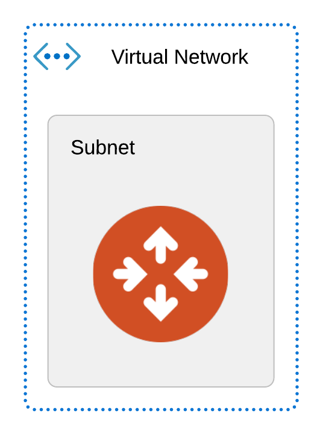
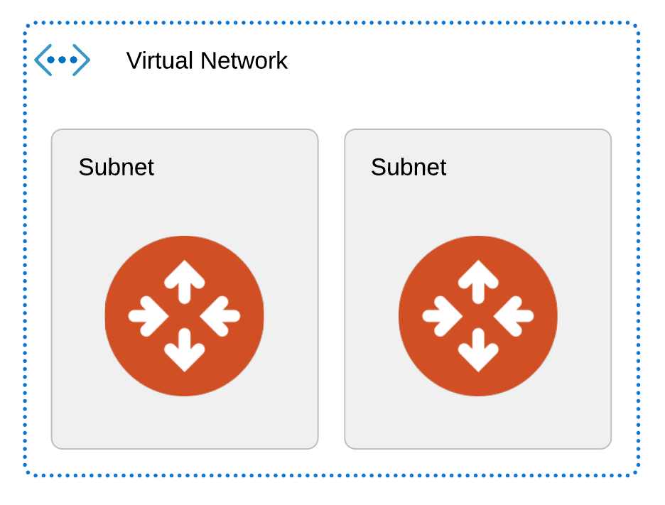

# Module Aviatrix Transit VPC for Azure

This module deploys a VPC and an Aviatrix transit gateway. Defining the Aviatrix Terraform provider is assumed upstream and is not part of this module.

The following variables are required:

key | value
--- | ---
region | Azure region to deploy the transit VNET in
azure_account_name | The Azure accountname on the Aviatrix controller, under which the controller will deploy this VNET
cidr | The IP CIDR wo be used to create the VNET.

The following variables are optional:

key | default | value
--- | --- | ---
instance_size | Standard_B1s | Size of the transit gateway instances
ha_gw | false | Set to true to enable deploying an HA GW

Outputs
This module will return the following objects:

key | description
--- | ---
vnet | The created vnet as an object with all of it's attributes. This was created using the aviatrix_vpc resource.
transit_gateway | The created Aviatrix transit gateway as an object with all of it's attributes.

When ha_gw is set to true, the deployed infrastructure will look like this:

